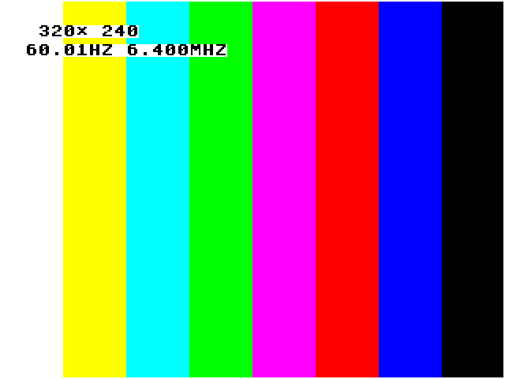
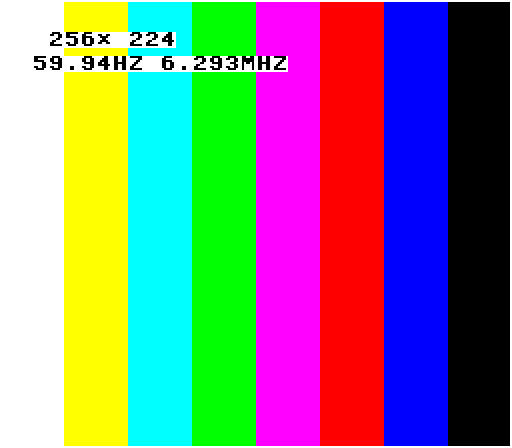
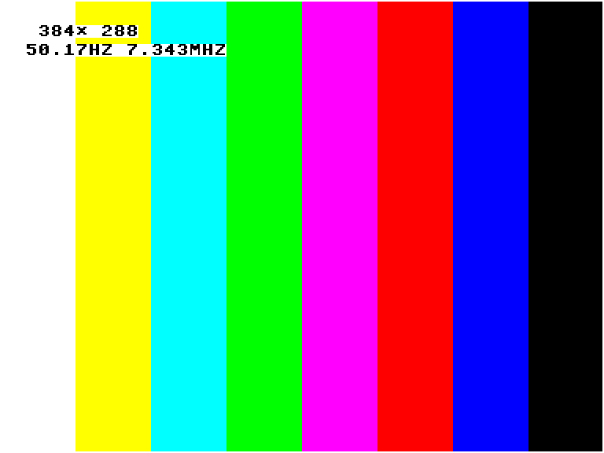
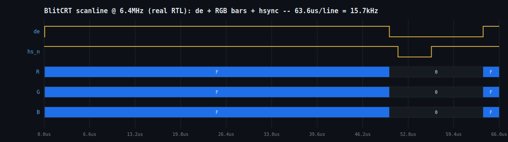
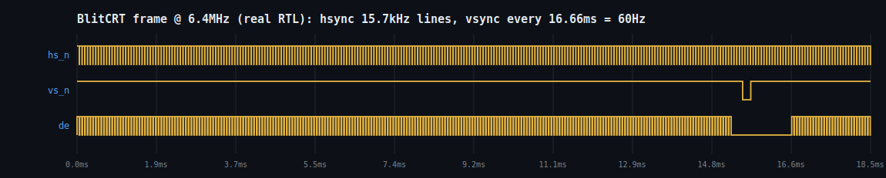

# BlitCRT

A programmable 15kHz video card in an FPGA. It streams blits rather than
buffering frames.

Author: Ben Templeman (alphanu1)

BlitCRT turns a Cyclone IV FPGA (Waveshare CoreEP4CE10 on a DVK600) into a
15kHz arcade-monitor video card driven over a USB FIFO. It speaks the CRT1
protocol, the same wire protocol as its sibling CRTPi, so GroovyMAME and
RetroArch (MME4CRT) via switchres can drive either device with the same
host code:

    MME4CRT / switchres  ->  CRT1  ->  BlitCRT (FT2232H FIFO)
                                   ->  Pi2SCART DAC  ->  15kHz CRT

BlitCRT is the device (the FPGA video card). CRT1 is the wire protocol it
speaks, the shared packet format also used by CRTPi. They are two different names on purpose.

## The test card

On power-up, and until the first frame arrives, BlitCRT paints a
self-describing test card from the timing generator alone, with no host
and no RAM:

It shows SMPTE colour bars, a 1px white border, and a two-line readout of
the current resolution and the measured vertical refresh and pixel clock,
e.g. `320x240` / `60.01HZ 6.400MHZ`. The refresh and clock are measured
on-device against the 50MHz crystal (rtl/mode_meter.v) rather than taken
from the host, so they reflect the achieved timing including PLL
quantization. Switching resolutions over UART re-renders the card with
updated numbers on each SET_MODE, so a mode can be confirmed on the CRT
without streaming a frame. The card gives way to live video on the first
CMD_FRAME.

### Simulated output

The images below are rendered from the RTL: a testbench runs the
video_timing_prog and splash_pattern modules and captures the RGB value
the design drives at every active pixel of a frame, then writes it to a
PNG. Three modes are shown; the readout tracks each resolution and its
measured fractional refresh (59.94, 50.17) and pixel clock.

| 320x240 @ 60.01Hz | 256x224 @ 59.94Hz | 384x288 @ 50.17Hz |
|---|---|---|
|  |  |  |

Regenerate with sim/tb_dump.v (see docs/VIDEOCARD_V2.md).

### Simulation waveforms

Timing diagrams from the same simulation (sim/tb_wave.v dumps a VCD of
video_timing_prog and splash_pattern at the 6.4MHz pixel clock).

Scanline: data-enable, the RGB bus stepping through the bars, and the
hsync pulse in blanking. One line is 63.6us (a 15.7kHz line rate).

Frame: the hsync train (one pulse per line) with a single vsync pulse per
frame. Vsync is every 16.66ms (60Hz).

## Blit streamer, not a framebuffer

BlitCRT holds no frame queue. The host does not hand it whole frames to
buffer and display later. Instead the host pushes damage rectangles over
CRT1 (a CMD_FRAME with x/y/w/h and pixels), and BlitCRT writes those bytes
into the live scanout buffer as they arrive. The timing generator reads
that same buffer out to the CRT continuously. Writes land in the region
being scanned out, in place; there is no separate present or flip step.

This has a few effects:

- Latency is roughly the wire-transfer time (about 6.6ms over the sync
  FIFO, under half a frame) rather than the one or two frames a buffered
  path adds.
- Partial updates are cheap. A game touching a quarter of the screen sends
  a quarter of the bytes; damage rectangles are part of the protocol.
- The device is simple and deterministic: no reordering, no queue
  management, no present step. Bytes in, pixels out.

A classic framebuffer card writes a full frame to off-screen memory, then
a flip at vsync swaps it in, which adds at least one frame of latency and
needs double-buffering. BlitCRT does neither.

## What's in the box

    rtl/          Verilog source
      fb_top_v2.v         top level
      crt1_ft245.v        CRT1 packet engine (SET_MODE/SET_PLL/FRAME/PAL)
      ft245_rx.v          FT245 async FIFO read engine
      ft245_tx.v          FT245 async FIFO write engine (reply path)
      uart_rx.v           UART byte source for bring-up
      video_timing_prog.v runtime-programmable timing generator
      framebuffer.v       4bpp dual-clock line/scanout buffer
      palette.v           16 x RGB444 lookup
      splash_pattern.v    test card (bars, border, res/Hz/clock readout)
      mode_meter.v        measures refresh + pixel clock from frame period
      pll_ctl.v           runtime pixel-clock reconfiguration sequencer
    sim/          iverilog testbenches
    quartus/      pins_pi2scart.tcl, SDC, templates
    host/         C client (crt1.c/.h, crt1_ftdi.c), Python, ref_sweep.py
    integration/  MME4CRT reference backend
    docs/         VIDEOCARD_V2, QUARTUS_BUILD, PI2SCART_OUTPUT

The generated Quartus project, with the two ALTPLL megafunctions wired in,
ships separately as the "-wired" bundle.

## The CRT1 protocol (summary)

12-byte header (magic 0x31545243 "CRT1", cmd, flags, seq, len LE) then a
command payload. Host to device: GET_INFO, SET_MODE (32-byte wire
modeline, switchres position semantics), SET_PLL (m/n/c dividers computed
host-side), FRAME (x/y/w/h damage rect and pixels), SET_PAL. Device to
host: EVT_INFO, EVT_MODE_RESULT (achieved clock readback), EVT_STATUS.
Full spec in docs/ and the shared CRTPi PROTOCOL.md.

## Hardware I/O

- Video out: RGB666 plus separate H/V sync on DVK600 32I/Os_2 holes 1..20,
  into a Pi2SCART resistor-ladder DAC. See docs/PI2SCART_OUTPUT.md for the
  pin/ball/ribbon map and the 5V safety note.
- Host link, selected by the USE_UART build parameter:
    - USE_UART=1 (default): CRT1 bytes over a plain USB-serial adapter
      (FTDI/CP2102/CH340) on one pin (32I/Os_2 hole 21), 2Mbaud = 0.2MB/s.
      This is for bring-up and resolution-change testing, not video
      streaming. A mode switch (SET_PLL+SET_MODE, ~0.65ms) and a static
      test frame go through fine, but a full 320x240 4bpp frame takes
      ~192ms (about 5fps), so it is not usable for live emulator output.
    - USE_UART=0: FT2232H FT245 FIFO on holes 21..32. Async today
      (~1MB/s); the sync FIFO (~40MB/s) is the path for full 60Hz frame
      streaming from MME4CRT.
  Both feed the same packet engine; nothing downstream changes.
- Clock: on-board 50MHz oscillator (PIN_E16). Reset on PIN_B16.

## Full pin mapping

All signals land on the DVK600 32I/Os_2 bank (fed by the CoreEP4CE10 H_Up
header, so the balls are exact). Hole numbers are the silkscreen labels on
the header; wire the ribbon from those holes.

### Video (always used), holes 1..20

    signal      hole   EP4CE10   Pi2SCART target
    vid_r6[5]    1      PIN_R11   R7  (Red MSB)
    vid_r6[4]    2      PIN_N12   R6
    vid_r6[3]    3      PIN_P11   R5
    vid_r6[2]    4      PIN_N11   R4
    vid_r6[1]    5      PIN_P9    R3
    vid_r6[0]    6      PIN_N9    R2  (Red LSB)
    vid_g6[5]    7      PIN_R10   G7  (Green MSB)
    vid_g6[4]    8      PIN_T11   G6
    vid_g6[3]    9      PIN_R9    G5
    vid_g6[2]   10      PIN_T10   G4
    vid_g6[1]   11      PIN_R8    G3
    vid_g6[0]   12      PIN_T9    G2  (Green LSB)
    vid_b6[5]   13      PIN_R7    B7  (Blue MSB)
    vid_b6[4]   14      PIN_T8    B6
    vid_b6[3]   15      PIN_R6    B5
    vid_b6[2]   16      PIN_T7    B4
    vid_b6[1]   17      PIN_R5    B3
    vid_b6[0]   18      PIN_T6    B2  (Blue LSB)
    vid_hs_n    19      PIN_R4    HSync
    vid_vs_n    20      PIN_T5    VSync

Note the Pi2SCART's RGB pins are not in numeric order on its connector;
each colour bit goes to a specific pin. See docs/PI2SCART_OUTPUT.md for the
exact CN3 pin per bit.

### Host link, holes 21..32 (pick one mode)

USE_UART=1 (default), one wire from a USB-serial adapter:

    signal        hole   EP4CE10   wire to
    uart_rx_pin   21      PIN_R3    USB-serial TX (plus GND to board GND)

USE_UART=0, FT2232H FT245 FIFO (hole 21 is then ft_data[0], not uart):

    signal      hole   EP4CE10   FT2232H (channel A, BDBUS)
    ft_data[0]  21      PIN_R3    D0
    ft_data[1]  22      PIN_T4    D1
    ft_data[2]  23      PIN_M9    D2
    ft_data[3]  24      PIN_T3    D3
    ft_data[4]  25      PIN_K9    D4
    ft_data[5]  26      PIN_L9    D5
    ft_data[6]  27      PIN_L8    D6
    ft_data[7]  28      PIN_K8    D7
    ft_rxf_n    29      PIN_M7    RXF#
    ft_txe_n    30      PIN_M8    TXE#
    ft_rd_n     31      PIN_M6    RD#
    ft_wr_n     32      PIN_L7    WR#

    System: clk50 = PIN_E16 (on-board osc), rst_n = PIN_B16 (RESET key).

Hole 21 is shared between uart_rx_pin and ft_data[0]; they are mutually
exclusive (chosen by USE_UART), so do not connect a USB-serial adapter and
an FT2232H at once. On the Pi2SCART side, do not wire its 5V pins (header
2/4) to any FPGA pin; the I/O is 3.3V.

## Throughput

The two host links differ by roughly 100x, which sets what each can do:

    link                 rate       320x240 4bpp frame   full 60Hz?
    UART 2Mbaud          0.2 MB/s   192 ms  (~5 fps)     no
    FT245 async          ~1 MB/s    38 ms   (~26 fps)    no (partial ok)
    FT245 sync FIFO      ~40 MB/s   ~1 ms                yes

A mode change is small (SET_PLL+SET_MODE, ~196 bytes, 0.65ms over UART),
so UART is fine for switching resolutions and painting a static frame.
Live video needs whole frames at 60Hz, 2.3MB/s (4bpp) up to 13MB/s
(RGB565), which only the FT2232H sync FIFO delivers. Async FT245 sits in
between and suits partial-frame updates but not full-frame 60Hz.

## Clock accuracy

PLL quantization is under 10.3ppm across the arcade clock battery. The
reference oscillator's own tolerance dominates, so the suggested upgrade
is a +/-1ppm 50MHz TCXO; the target frequency choice is under 1ppm either
way (see host/ref_sweep.py). Exact synthesis via an Si5351A is a later
option. Details in docs/VIDEOCARD_V2.md.

## Build and bring-up

1. Generate the two ALTPLL megafunctions in Quartus (docs/QUARTUS_BUILD.md),
   or use the -wired bundle which already has them.
2. `source quartus/pins_pi2scart.tcl` in the Tcl console.
3. Add an SDC (create_clock 50MHz, derive_pll_clocks; quartus/fb_top.sdc).
4. Start Compilation, then flash the .sof over JTAG.
5. Power on. The test card appears on the CRT with no host attached, which
   exercises PLL lock, timing, the DAC, and the ribbon together.
6. To test resolution switching from the PC (USE_UART=1): wire a
   USB-serial adapter's TX to hole 21 and GND to board GND, then run
   host/crt1_uart_test.py PORT <modeline>. This confirms mode switching
   and a painted frame; it is not fast enough for live video. For 60Hz
   video, build with USE_UART=0 and use the FT2232H sync-FIFO path.

## Status

RTL complete and simulated (testbenches for the UART and FT245 paths, the
mode meter, and PLL reconfig). Megafunctions generated and wired; the top
elaborates clean. Pins assigned. Remaining: full Quartus compile and
hardware bring-up, then the sync-FIFO upgrade for full-rate 60Hz frames.
