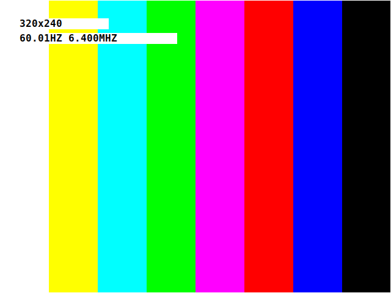

# BlitCRT

**A programmable 15kHz video card in an FPGA -- a blit streamer, not a framebuffer.**

Author: Ben Templeman (alphanu1)

BlitCRT turns a Cyclone IV FPGA (Waveshare CoreEP4CE10 on a DVK600) into
a 15kHz arcade-monitor video card driven over a USB FIFO. It speaks the
**CRT1** protocol -- the same wire protocol as its sibling **CRTPi** --
so GroovyMAME / RetroArch (MME4CRT) via switchres can drive either
device with identical host code:

    MME4CRT / switchres  ->  CRT1  ->  BlitCRT (FT2232H FIFO)
                                   ->  Pi2SCART DAC  ->  15kHz CRT

> Naming: **BlitCRT** is this device (the FPGA video card). **CRT1** is the
> wire protocol it speaks -- the shared packet format also used by CRTPi.
> The device and the protocol are intentionally different names.

## The test card

On power-up (and until the first real frame arrives) BlitCRT paints a
self-describing test card straight from the timing generator -- no host,
no RAM:

SMPTE colour bars, a 1px white border, and a two-line readout showing the
**live resolution** and the **measured** vertical refresh and pixel clock
-- e.g. `320x240` / `60.01HZ 6.400MHZ`. The refresh and clock are not
host-claimed numbers: they are measured on-device against the 50MHz
crystal (rtl/mode_meter.v), so they show the TRUE achieved timing
including any PLL quantization. Switch resolutions over UART and the card
re-renders with updated numbers on each SET_MODE, so you can confirm every
mode on the CRT without streaming a frame. It yields to live video the
moment a real CMD_FRAME arrives.

## It's a blit streamer, not a framebuffer

This is the core architectural idea and the reason BlitCRT is low-latency:

**BlitCRT holds no frame queue.** The host does not hand it whole frames
to buffer and display later. Instead the host pushes **damage rectangles**
over CRT1 (a CMD_FRAME with x/y/w/h + pixels), and BlitCRT **blits those
bytes straight into the live scanout buffer** as they arrive. The timing
generator reads that same buffer out continuously to the CRT. There is no
"frame N buffered while frame N+1 arrives" -- writes land in the region
being scanned out, in place.

Consequences:
- **Latency is essentially just wire-transfer time** (~6.6ms over sync
  FIFO, under half a frame), not the one-to-two frames a buffered display
  adds. Less than most RetroArch shaders; far below any modern LCD.
- **Partial updates are cheap.** A game touching a quarter of the screen
  sends a quarter of the bytes -- damage rectangles are first-class in the
  protocol, not an afterthought.
- **The device is dumb and deterministic.** No frame reordering, no queue
  management, no "present" step. Bytes in -> pixels out. That is exactly
  what you want for a reference instrument you can trust against a CRT.

Contrast a classic framebuffer card: the host writes a full frame to
off-screen memory, then a flip/present swaps it in at vsync -- inherently
adding at least one frame of latency and requiring double-buffering.
BlitCRT deliberately does neither.

## What's in the box

    rtl/          Verilog: the whole video card
      fb_top_v2.v         top level (wiring hub)
      crt1_ft245.v        CRT1 packet engine (SET_MODE/SET_PLL/FRAME/PAL)
      ft245_rx.v          FT245 async FIFO read engine
      ft245_tx.v          FT245 async FIFO write engine (reply path)
      video_timing_prog.v runtime-programmable timing generator
      framebuffer.v       4bpp dual-clock line/scanout buffer
      palette.v           16 x RGB444 lookup
      splash_pattern.v    test card (bars + border + res/Hz/clock readout)
      pll_ctl.v           runtime pixel-clock reconfiguration sequencer
    sim/          testbenches (iverilog) -- all pass
    quartus/      pins_pi2scart.tcl, SDC, templates
    host/         C client (crt1.c/.h, crt1_ftdi.c) + Python + ref_sweep.py
    integration/  MME4CRT reference backend
    docs/         VIDEOCARD_V2, QUARTUS_BUILD, PI2SCART_OUTPUT

The generated Quartus project (with the two ALTPLL megafunctions wired
in) ships separately as the "-wired" bundle.

## The CRT1 protocol (summary)

12-byte header (magic 0x31545243 "CRT1", cmd, flags, seq, len LE) then a
command payload. Host -> device: GET_INFO, SET_MODE (32-byte wire
modeline, switchres position semantics), SET_PLL (m/n/c dividers computed
host-side), FRAME (x/y/w/h damage rect + pixels), SET_PAL. Device ->
host: EVT_INFO, EVT_MODE_RESULT (achieved clock readback), EVT_STATUS.
Full spec in docs/ and the shared CRTPi PROTOCOL.md.

## Hardware I/O

- **Video out:** RGB666 + separate H/V sync on DVK600 32I/Os_2 holes
  1..20, into a Pi2SCART resistor-ladder DAC. See docs/PI2SCART_OUTPUT.md
  for the exact pin/ball/ribbon map and the 5V safety rule.
- **Host link (two options, selected by the USE_UART build parameter):**
    - `USE_UART=1` (default, **testing only**): CRT1 bytes over a plain
      USB-serial adapter (FTDI/CP2102/CH340 -- a cable you probably
      already have) on a single pin (32I/Os_2 hole 21). ~3Mbaud = 0.3MB/s.
      **This is for bring-up and resolution-change testing, NOT for
      streaming video.** It sends a mode switch (SET_PLL+SET_MODE, ~0.65ms)
      and a static test frame perfectly, but a full frame takes 128ms
      (320x240 4bpp) to 512ms (RGB565) -- i.e. ~2-8 fps, not 60. Use it to
      prove the FPGA switches resolution and paints a frame; do not expect
      live emulator output over it.
    - `USE_UART=0` (**the real path for video**): FT2232H FT245 FIFO on
      holes 21..32. Async today (~1MB/s); sync FIFO (~40MB/s) is the
      upgrade for full 60Hz frame streaming from MME4CRT.
  The two share the downstream packet engine; nothing else changes.
- **Clock:** on-board 50MHz oscillator (PIN_E16). Reset on PIN_B16.

## Full pin mapping

All signals land on the DVK600 **32I/Os_2** bank (fed by the CoreEP4CE10
H_Up header, so balls are exact). Bank hole numbers are the silkscreen
labels on the header; wire your ribbon from those holes.

### Video (always used) -- holes 1..20

    signal      hole   EP4CE10   Pi2SCART target
    vid_r6[5]    1      PIN_R11   R7  (Red MSB)
    vid_r6[4]    2      PIN_N12   R6
    vid_r6[3]    3      PIN_P11   R5
    vid_r6[2]    4      PIN_N11   R4
    vid_r6[1]    5      PIN_P9    R3
    vid_r6[0]    6      PIN_N9    R2  (Red LSB)
    vid_g6[5]    7      PIN_R10   G7  (Green MSB)
    vid_g6[4]    8      PIN_T11   G6
    vid_g6[3]    9      PIN_R9    G5
    vid_g6[2]   10      PIN_T10   G4
    vid_g6[1]   11      PIN_R8    G3
    vid_g6[0]   12      PIN_T9    G2  (Green LSB)
    vid_b6[5]   13      PIN_R7    B7  (Blue MSB)
    vid_b6[4]   14      PIN_T8    B6
    vid_b6[3]   15      PIN_R6    B5
    vid_b6[2]   16      PIN_T7    B4
    vid_b6[1]   17      PIN_R5    B3
    vid_b6[0]   18      PIN_T6    B2  (Blue LSB)
    vid_hs_n    19      PIN_R4    HSync (GPIO25)
    vid_vs_n    20      PIN_T5    VSync (GPIO26)

### Host link -- holes 21..32 (pick ONE mode)

USE_UART=1 (default, **testing / resolution changes only -- NOT video
streaming**) -- ONE wire from a USB-serial adapter:

    signal        hole   EP4CE10   wire to
    uart_rx_pin   21      PIN_R3    USB-serial TX (+ GND to board GND)

USE_UART=0 -- FT2232H FT245 FIFO (hole 21 is then ft_data[0], NOT uart):

    signal      hole   EP4CE10   FT2232H (channel A, BDBUS)
    ft_data[0]  21      PIN_R3    D0
    ft_data[1]  22      PIN_T4    D1
    ft_data[2]  23      PIN_M9    D2
    ft_data[3]  24      PIN_T3    D3
    ft_data[4]  25      PIN_K9    D4
    ft_data[5]  26      PIN_L9    D5
    ft_data[6]  27      PIN_L8    D6
    ft_data[7]  28      PIN_K8    D7
    ft_rxf_n    29      PIN_M7    RXF#
    ft_txe_n    30      PIN_M8    TXE#
    ft_rd_n     31      PIN_M6    RD#
    ft_wr_n     32      PIN_L7    WR#

    System: clk50 = PIN_E16 (on-board osc), rst_n = PIN_B16 (RESET key).

**Hole 21 is shared** between uart_rx_pin and ft_data[0] -- they are
mutually exclusive (chosen by USE_UART). Never connect a USB-serial
adapter and an FT2232H at the same time. And on the Pi2SCART side, never
wire its 5V pins (Pi header 2/4) to any FPGA pin -- 3.3V I/O, 5V kills it.

## Throughput: why UART is test-only

The two host links differ by ~100x, which decides what each can do:

    link                 rate       320x240 4bpp frame   full 60Hz?
    UART 3Mbaud          0.3 MB/s   128 ms  (~8 fps)     no
    FT245 async          ~1 MB/s    38 ms   (~26 fps)    no (partial ok)
    FT245 sync FIFO      ~40 MB/s   ~1 ms                yes

A mode change is tiny (SET_PLL+SET_MODE ~196 bytes, 0.65ms over UART), so
UART is fine for **testing resolution switches and painting a static
frame**. Streaming live emulator video needs whole frames at 60Hz --
2.3 MB/s (4bpp) to 13 MB/s (RGB565) -- which only the FT2232H **sync
FIFO** path delivers. Async FT245 sits in between: good for partial-frame
(damage-rect) updates, not full-frame 60Hz. Plan: UART for bring-up,
FT2232H sync FIFO for the real video card.

## Clock accuracy

PLL quantization is <=10.3ppm across the arcade clock battery. The
reference oscillator's own tolerance dominates, so the recommended
upgrade is a +/-1ppm 50MHz TCXO (frequency choice is a <1ppm wash --
see host/ref_sweep.py). Exact synthesis via an Si5351A is the endgame.
Details in docs/VIDEOCARD_V2.md.

## Build & bring-up

1. Generate the two ALTPLL megafunctions in Quartus (docs/QUARTUS_BUILD.md),
   or use the -wired bundle which already has them.
2. `source quartus/pins_pi2scart.tcl` in the Tcl console.
3. Add an SDC (create_clock 50MHz, derive_pll_clocks; quartus/fb_top.sdc).
4. Processing -> Start Compilation -> flash the .sof over JTAG.
5. Power on: the splash (bars + border) appears on the CRT -- validating
   PLL lock, timing, the DAC, and the ribbon all at once. NO host needed
   for the splash.
6. To TEST resolution switching from the PC: with USE_UART=1 (default),
   wire a USB-serial adapter's TX -> hole 21 and GND -> board GND, then
   run host/crt1_uart_test.py PORT <modeline>. This proves the FPGA
   switches mode and paints a frame -- it is NOT fast enough for live
   video (~2-8 fps full-frame). For streamed 60Hz video, build with
   USE_UART=0 and use the FT2232H sync-FIFO path.

## Status

RTL complete and simulated (5 testbenches pass, including the FT245 TX
engine and PLL reconfig). Megafunctions generated and wired; top
elaborates clean. Pins assigned with certainty. Next: Quartus compile +
hardware bring-up, then the sync-FIFO upgrade for full-rate 60Hz frames.
